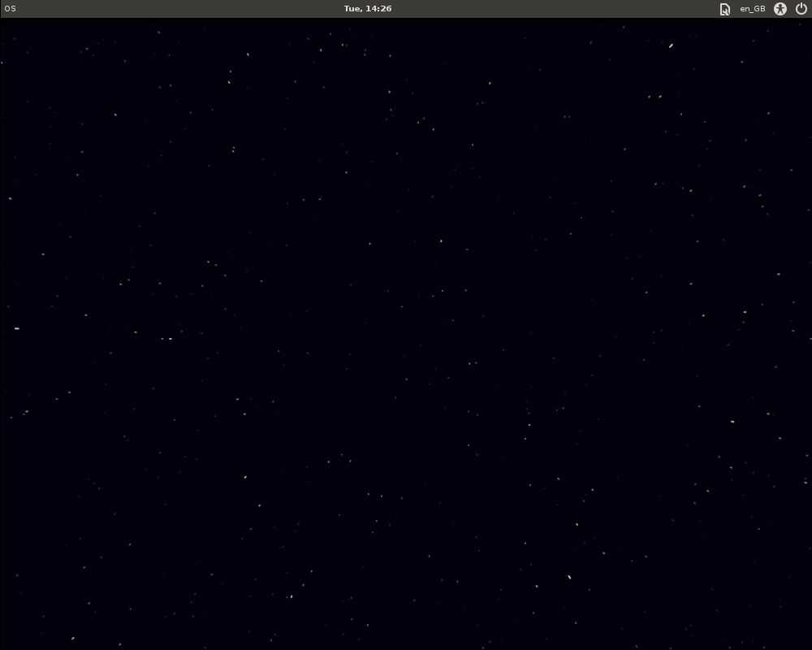

lightdm-starfield-greeter
=========================

So I went and forked [lightdm-gtk-greeter](https://launchpad.net/lightdm-gtk-greeter/) and ripped out all
the boring bits (user select, avatar, password box) and replaced them with **stars**!

This greeter is good for a single user (last user logged in by default). All you need to do is enter your password!

Most of the functional stuff is in ``src/lightdm-gtk-greeter.c`` which still looks for the most part very much like
the original - fun stuff is in ``src/starfield.h`` - change colours, movement, star density, etc. - hack away!

Build
-----

The first time you clone this project you'll want to configure it:

    ./configure

Once this is done you can rebuild by doing:

    sudo make clean install

Easy, ne?

Screenshot
----------

